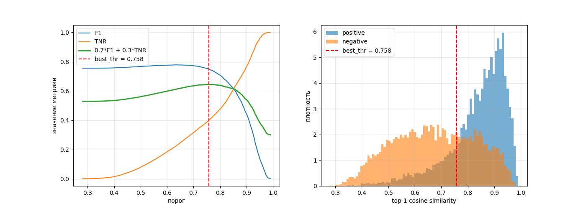

# falcon-hack-2026

Сервис формирования цифрового признака ТС для сопоставления снимков одного
автомобиля из разных локаций без использования государственного номера.

**Задача.** Для каждого query-изображения из `test_query.csv` упорядочить
объекты `test_gallery.csv` по убыванию вероятности принадлежности тому же ТС.
Дополнительно — режим отказа: вернуть пустой ответ, если уверенного совпадения
в галерее нет.

---

## 0. Веса

Перед запуском необходимо скачать и положить в репозиторий следующие артефакты.

### `weights/`

Готовые веса модели (backbone + проекция), используются на инференсе.
**Обязательно
скачать: [веса модели](https://drive.google.com/drive/folders/1dwPs--m01I6z9IN59Ow80hH8XRyJZ0jS?usp=sharing)**

Ожидаемая структура:

```
weights/
  config.json
  model.safetensors
  proj.pt
```

### `convnextv2-base-pretrained/`

Backbone после первого этапа обучения (classification pretrain). Нужен только
для воспроизведения finetune и для сравнения с финальной моделью.

Скачать: **[backbone после pretrain](https://drive.google.com/drive/folders/13869A0w3tQfdIEBwTiNLGaomSUgAo6J5?usp=sharing)**

Для запуска инференса этот каталог не требуется — используется только `weights/`.

---

## 1. Запуск

### Требования

- Docker + Docker Compose v2.30+
- NVIDIA Container Toolkit (для GPU)
- `--shm-size=4g` при запуске контейнера (DataLoader с `num_workers>0`)

### Структура данных

Ожидается, что каталог с данными (`DATA_DIR`) содержит:

```
data/
  images/                 # плоский каталог, JPEG
  test_query.csv          # image_id, x, y, w, h
  test_gallery.csv        # image_id, x, y, w, h
```

### Запуск одной командой

```bash
docker compose up --build --abort-on-container-exit
```

### Артефакты

После запуска в `OUTPUT_DIR` появятся:

- `submission.csv` — top-10 кандидатов на каждый query (11 колонок, **без заголовка**)
- `embeddings.npy` — `float32`, форма `(Nq + Ng, 512)`, порядок: сначала query в
  порядке `test_query.csv`, затем gallery в порядке `test_gallery.csv`
- `candidates.csv` — заголовок `query_id,gallery_id,confidence`; отказ кодируется
  **отсутствием строк** для этого `query_id`

### Демо-сервис (опционально)

```bash
docker run --gpus all --rm -p 8000:8000 --shm-size=4g falcon-reid:latest \
  uvicorn api:app --host 0.0.0.0 --port 8000
```

Swagger UI: `http://localhost:8000/docs`.

---

## 2. Порог отказа

Порог для `candidates.csv` подобран на локальном open-set протоколе.

### Протокол

Из галереи удаляются **все** кадры выбранных `vehicle_id` (не только пара
конкретного запроса) — это воспроизводит реальный open-set. На каждом из 3
фолдов и 20 сидов получается свой набор `(score, label, top1_correct)`, которые
затем пулятся в один массив (~111k пар).

Метрика — `combo = 0.7 · F1 + 0.3 · TNR`, micro, по формулировке из Q&A:

- **TP**: есть пара, приняли, top-1 верный
- **FP**: приняли, но top-1 неверный; либо пары нет, а приняли
- **FN**: есть пара, но не приняли
- **TN**: пары нет, и не приняли

### Результат

На пуле:

| Метрика            | Значение        |
|--------------------|-----------------|
| `best_thr`         | 0.7578          |
| F1                 | 0.7487          |
| TNR                | 0.4014          |
| combo              | 0.6445          |
| **Ожидаемый балл** | **≈ 6.45 / 10** |

Кривые `F1 / TNR / combo` и распределения score для positive/negative:



### Калибровка на тесте

Распределение top-1 score на тесте сдвинуто вправо относительно val. Поэтому
применяется **квантильный матчинг**: порог на тесте подбирается так, чтобы
сохранить ту же долю отказов, что была на val (28.2%).

```
thr_test = np.quantile(test_top1_scores, val_refusal_rate)
```

Это даёт устойчивый порог, независимый от абсолютной шкалы score.

Финальное значение — в `inference.py`, аргумент `--threshold`.

---

## 3. Обучение

Двухэтапная схема: сначала классификация на внешних данных, затем metric
learning на целевых.

### Backbone

`ConvNeXt-V2-Base-22k-224` (HuggingFace), `drop_path_rate=0.5`. Проекция
1024 → 512 без bias, L2-нормализация. `torch.compile(mode="reduce-overhead")`,
AMP bfloat16.

### Этап 1 — pretrain (classification)

Датасеты:

- [CompCars](https://mmlab.ie.cuhk.edu.hk/datasets/comp_cars/instruction.txt)
- [Car-1000](https://github.com/toggle1995/Car-1000)

Итого **276 993 изображения, 5 446 классов**. Класс = путь к папке с
изображениями.

Голова: нормированный классификатор CosFace-типа со скейлом
`s = √2 · ln(C − 1)`. Лосс: weighted CE, `weight = 1/√count(class)`,
нормированный на среднее. Аугментации: `Resize(224)`, `RandomHorizontalFlip`,
`TrivialAugmentWide`, `RandomErasing`.

8 эпох, warmup 1, линейный спад LR. Оптимизатор — **Muon** (для 2D-весов) +
Adam (для LayerNorm, bias и прочего).

### Этап 2 — finetune (metric learning)

PK-сэмплинг: positive с другой `camera_id` того же `vehicle_id`, hard negative —
другой `vehicle_id` с той же камеры. `camera_id` используется **только** при
формировании батчей, в модель не подаётся (в тесте его нет).

Лоссы: `CircleLoss(m=0.25, γ=32)` + `CosFaceLoss(margin=0.25, scale=√2·ln(C−1))`.

3-fold разбиение по `vehicle_id` + отдельный прогон на полных данных. Финальный
эмбеддинг — результат модели, обученной на всех данных.

### Muon

Оптимизатор второго порядка на основе ортогонализации градиента
(Newton–Schulz). Применяется к 2D-матрицам: `pwconv1`, `pwconv2`,
`downsampling_layer.1` в ConvNeXt и к проекции 1024→512. Для LayerNorm, bias
и головы лосса используется Adam.

### Гиперпараметры

| Параметр             | Pretrain | Finetune    |
|----------------------|----------|-------------|
| LR backbone          | 1e-4     | 4e-5        |
| LR проекции / головы | 1e-3     | 1e-3        |
| Epochs               | 8        | 17          |
| Warmup               | 1        | 1           |
| Batch (изображений)  | 32       | 16 × 3 (PK) |
| AMP                  | bfloat16 | bfloat16    |
| Grad clip            | —        | 1.0         |

### Валидация

mAP@10 по фолдам: **0.783 ± 0.005**. На тесте mAP@10 считается организаторами
по `submission.csv`.

---

## Внешние источники

| Источник                                                                            | Назначение              |
|-------------------------------------------------------------------------------------|-------------------------|
| [ConvNeXt-V2-Base-22k-224](https://huggingface.co/facebook/convnextv2-base-22k-224) | pretrained backbone     |
| [CompCars](https://mmlab.ie.cuhk.edu.hk/datasets/comp_cars/instruction.txt)         | pretrain                |
| [Car-1000](https://github.com/toggle1995/Car-1000)                                  | pretrain                |
| [pytorch-metric-learning](https://github.com/KevinMusgrave/pytorch-metric-learning) | CircleLoss, CosFaceLoss |
| [Muon](https://github.com/KellerJordan/Muon)                                        | оптимизатор             |

Использование государственных регистрационных знаков или их остаточных
признаков в обучении и инференсе исключено: изображения поступают с уже
размытыми номерами и лицами.

---

## Ограничения решения

- Порог отказа откалиброван на локальном open-set протоколе; на тесте
  применяется через квантильный матчинг. Если распределение скоров на тесте
  существенно изменит форму (не только сдвиг), калибровка может быть неточной.
- Recall@1 модели на локальной валидации — 0.758. Это ограничивает потолок
  F1 в режиме кандидатов независимо от выбранного порога.
- k-reciprocal re-ranking внутри top-K одного запроса и ансамблирование
  эмбеддингов по фолдам — потенциальные направления улучшения, не вошедшие
  в финальную версию по времени.
